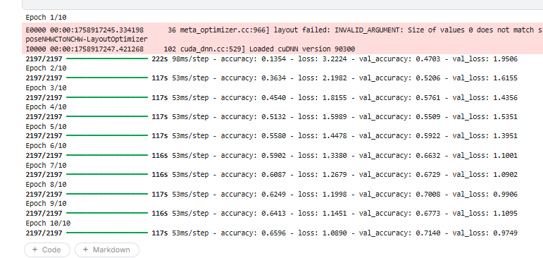

# Plant Disease Classification (CNN)

Bu proje Akbank Deep Learning Bootcamp kapsamında gerçekleştirilmiştir. Amacım bitki yapraklarının fotoğraflarını kullanarak **hastalıklı / sağlıklı sınıflandırması** yapan bir Convolutional Neural Network (CNN) modeli geliştirmektir. Proje Kaggle üzerinde eğitilmiş ve sonuçlar GitHub reposunda paylaşılmıştır.  

---

## Giriş

Bu projede kullanılan veri seti **New Plant Diseases Dataset (Augmented)** adlı Kaggle veri setidir. Veri seti 38 farklı sınıf içermektedir. 

Amacım bu veriyi kullanarak **bitki yapraklarındaki hastalıkları sınıflandıran** bir derin öğrenme modeli kurmak, eğitmek ve performansını değerlendirmektir.  

Model:
- CNN tabanlı mimari
- Data Augmentation   
- Conv2D + MaxPooling katmanları  
- Dropout ile overfitting azaltma
- Flatten katmanı  
- Dense(softmax) ile 38 sınıf tahmini  

Kullanılan kütüphaneler: **TensorFlow, Keras, scikit-learn, seaborn, matplotlib,numpy,pandas**

---

## Metrikler

Modelin eğitimi sonucunda elde edilen temel metrikler şunlardır:
Validation Accuracy: %71
Validation Macro F1-score: 0.69
Validation Weighted F1-score: 0.68

Eğitim sürecinde:
- Accuracy / Loss eğrileri incelendi.
- CNN algoritması, katmanlar gibi yazdığım her kodun arkasındaki çalışma mantığı anlaşılmıştır.  
- Confusion Matrix (Heatmap) ile sınıflar bazında başarı görselleştirildi.  
- Grad-CAM ile modelin hangi yaprak bölgelerine odaklandığı gösterildi.  

> Not: Veri setindeki “test” klasörü yalnızca 33 görsel içerdiğinden, **validation set** değerlendirme için kullanılmıştır.Resimler bunun uzerine görselleştirilmiştir.

---

## Ekler

- GPU ortamı: Kaggle (Tesla P100 / T4)   

---

## Sonuç ve Gelecek Çalışmalar

Bu çalışmayla, CNN tabanlı bir modelin bitki yapraklarındaki hastalıkları sınıflandırmada etkili olduğu gösterilmiştir. Validation setinde %68 başarıya ulaşılmıştır. hiper parametre optimizasyonu yapılmış learning rate ve epoch sayıları değiştirilmiştir.
Bu proje kapsamında CNN tabanlı bir modelin nasıl oluşturulduğunu ne yapıldığını anlamış bulundum .

**Gelecek çalışmalar:**
Daha yuksek bir accurasy değerine ulasmak için ResNet kullanmayı dusunuyorum.
hiperparametreleri daha iyi deneyip gridSearch gibi fonksiyonlar ile daha kapsamlı ele almayı duşunuyorum.

---

## Görseller

 
  

  
  

---

## Linkler

- 🔗 **Kaggle Notebook:** [Link buraya](https://www.kaggle.com/...)  
- 🔗 **GitHub Repo:** [Link buraya](https://github.com/...)  
